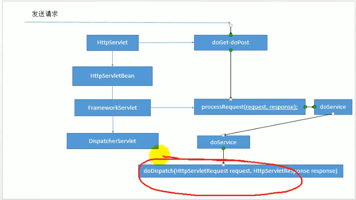
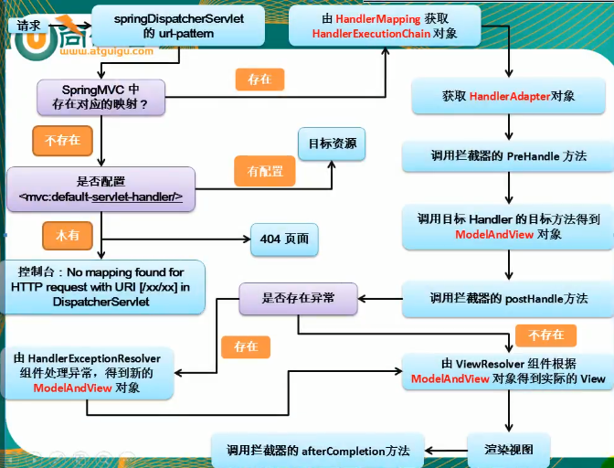

- [SSM](#ssm)
  - [1.Spring](#1spring)
    - [1.1 IOC:(Inversion(反转) Of Control)：控制反转；](#11-iocinversion反转-of-control控制反转)
    - [1.2 DI：（Dependency Injection）依赖注入;](#12-didependency-injection依赖注入)
    - [1.3 bean](#13-bean)
    - [1.4 AOP](#14-aop)
    - [1.5 事务](#15-事务)
    - [1.6 SpringMVC](#16-springmvc)
    - [1.7 Rest风格](#17-rest风格)
    - [1.8 MyBatis](#18-mybatis)
----
# SSM
## 1.Spring
- IOC（容器）  
　Struts2
　Hibernate
　Mybatis  
- AOP（面向切面编程） 声明式事务  
　Spring-JdbcTemplate  

### 1.1 IOC:(Inversion(反转) Of Control)：控制反转；  
- 控制：资源的获取方式
    - 主动式：（需要什么资源自己创建）  
        ```
        BookServlet{BookService bs = new BookService();}
        ```
    - 被动式：（）
        ```
        BookServlet{
            BookService bs;
            public void test01(){
                bs.checkout();
            }
        }
        ```  
- 容器：管理所有的组件（有功能的类）；假设，BookServlet受容器管理，BookService也受容器管理；容器可以自动的探查出那些组件（类），需要用到另一些组件（类）；容器帮我们创建BookService对象，并把BookService对象赋值过去；  

容器：主动的new资源变为被动接受资源；  
（容器）婚介所；  
- 主动获取变为被动接受；  

### 1.2 DI：（Dependency Injection）依赖注入;  
- 容器能知道哪个组件（类）运行的时候，需要另一个类（组件）;容器通过反射的形式，将容器中准备好的BookService对象注入（利用反射给属性赋值）到BookServlet中；
- 只要容器管理的组件，都能使用容器提供强大的功能；
- 框架编写流程：
  ```
  1. 导包
    核心容器：
    spring-bean-....jar
    ...context-....jar
    ...core....jar
    ...expression....jar
  2. 写配置
    Spring的配置文件中，集合了spring的ioc容器管理的所有组件（会员清单）;
    创建一个Spring Bean Configuration File(Spring的bean配置文件)
    ioc.xml
    <!-- 使用property标签为Person对象的属性赋值
        name="lastName"：指定属性名
        value="张三"：为这个属性赋值
     -->
    <beans ...>
        <bean id="person01 " class="com.*.*.Person">
            <property name="lastname" value="张三"></property>
            <property name="age" value="12"></property>
        </bean>
    </beans>
  3. 测试
    存在的几个问题：
    1.src,源码包开始的路径，称为类路径的开始；
        所有源码包里面的东西都会被合并放在类路径里面；
        java:/bin/
        web:/web-inf/classes/
    2.导包commons-logging*.jar 依赖
    3.先导包再创建配置文件；
    4.Spring的容器接管了标志S的类；
    细节：
    1. ApplicationContext（IOC的容器接口）
        FileSystemXmlApplicationContext("F://ioc.xml");ioc容器的配置文件再磁盘路径下
    2. 组件的创建工作是容器完成的；
        容器中对象的创建再容器创建完成的时候已经创建好了
    3. 同一个组件在ioc容器中是单实例的，容器创建完成的时候已经创建好了
    4. 容器如果没有这个组件，报异常NoSuchBean....
    5. property会利用setter方法为javaBean的属性进行赋值
    6. javaBean的属性名是由什么决定的？getter/setter方法是属性名，去掉set然后小写首字母
        所有getter/serter都自动生成
    7.
    //从容器中获取组件
    @Test
    public void test(){
        //ApplicationCOntext:代表ioc容器
        //ClassPathXmlApplicationContext:当前应用的xml配置文件在ClassPath下
        //根据spring的配置文件得到ioc容器
        ApplicationCOntext ioc = new ClassPathXmlApplicationContext("ioc.xml");
        Person bean = ioc.getBean("person01");
    }
  ```
### 1.3 bean
- 根据bean的类型从ioc容器获取bean实例
- 通过构造器为bean的属性进行赋值
- 通过构造器为bean的属性进行赋值（index-type）
- 通过p命名空间为bean赋值
- 属性赋值null  
  ```
  <proerty name="lastname">
    <null/>
  </proerty>
  ```
- ref引用外部的值
- 引用内部的bean
- list属性赋值
- map属性赋值
  ```
  <proerty name="lastname">
    <map>
        <entry key="k1" value="1"></entry>
        <entry key="k1"><value>test</value></entry>
        <entry key="k2" ref=""></entry>
        <entry key="k3">
            <bean class="com.*.*">
            </bean>
        </entry>
    </map>
  </proerty>
  ```
- properties属性赋值
  ``` 
  <!-- 均为string类型 -->
  <proerty name="properties">
    <props key="name">root</props>
  </proerty>
  ```
- util名称空间创建集合类型的bean；方便别人引用
  ``` 
  <!-- 均为string类型 -->
  <uitl:map id="mymap">
    <entry key=""></entry>
    <list></list>
    <value></value>
    <ref bean="mymap"/>
  </uitl:map>
  <proerty name="maps" ref="mymap">
  ```
- 级联属性赋值  
  属性的属性
  ```
  <bean id="" class="">
    <property name="car" ref="car01">
    </property>
    <!-- 为属性的属性赋值 -->
    <property name="car.price" value="11"></property>
  </bean>
  ```
- 继承实现bean的重用
  ```
  <!-- 仅继承配置信息，class可不写 -->
  <bean id="" class="" parent="person05" abstract="true">
    <property name="name" value="李四"></property>
  </bean>
  ```
- bean的abstract属性仅允许被继承，不允许实例化
  ```
  <!-- abstract -->
  <bean id="" class="" parent="person05" abstract="true">
    <property name="name" value="李四"></property>
  </bean>
  ```
- bean之间的依赖
  ```
  默认按照配置的顺序创建
  depends-on="person,car"
  ```
- *bean的作用域，单实例和多实例
  ```
  bean默认为单实例
  scope属性：
    prototype:多实例
        1. 默认不会创建多实例bean
        2. 获取的时候创建bean
        3. 每次获取时创建对象
    singleton:单实例，默认
        1. 容器启动完成之前就创建好对象，保存在容器中
        2. 任何时候获取都是同一个实例
    request:web环境下，同一次请求创建一个bean实例（没用）
    session:web环境下，同一次会话创建一个bean实例（没用）
    <bean id="test" class="" scope=""></bean>
  ```
- *静态工厂方法创建bean,实例工厂方法创建的bean、FactoryBean
  ```
  bean的创建默认就是框架利用反射new出来的bean实例
  静态工厂：工厂本身不创建对象，通过静态方法调用，对象 = 工厂类.工厂方法名（）
  <bean id="" class="*.*Factory" factory-method="getAirPlan">
    <constructor-arg value="lisi">/<constructor>
  </bean>
  实例工厂：工厂本身需要创建对象
    AirPlane air = new AirPlane();

    <bean id="factory" class=""></bean>
    <!-- 未使用反射创建的 -->
    <bean id="" class="*.*Factory" factory-bean="Factory" factory-method="getAirPlan>
    <constructor-arg value="lisi">/<constructor>
  </bean>

  FactoryBean:
  ioc容器启动时不会创建实例，获取时创建

  1. 编写一个FactoryBean的实现类
    implements FactoryBean<Book>{
        @Override
        public Book getObject(){
            Book book = new ...;
            return book
        }
        @Override
        public Class<?> getObjectType(){
            retun book.class;
        }
        @Override
        pulic boolean isSingleton(){
            return false;
        }
    }
  2. 在spring配置文件中进行注册
  ```
- 创建带生命周期的bean
  ```
    单例：bean的生命周期 
      （容器开启）构造器--->初始化方法--->（容器关闭）销毁方法
    多实例：
      获取bean（构造器--->初始化方法）--->容器关闭不会调用bean的销毁方法
  ```
- 后置处理器
  ```
  （容器开启）构造器--->后置处理器before--->初始化方法--->后置处理器after--->（容器关闭）销毁方法
  多实例无销毁

    public class MyBeanPostProcess implements BeanPostProcessor

    xml注册 <bean id="process" class="com.testchn.bean.MyBeanPostProcess"></bean>

  ```
- 12.引用外部属性文件
  ```
  ioc.getBean(DataSource.class)
  <context:property-placeholder location="classpath:dbconfig.properties">
  <property name="" value="${username}"></property>
  <!-- username是spring的key中的一个关键字不能用 -->
  ```
- 源码和普通文件夹
- 基于xml的自动装配
  ```
  <bean autowire=""></bean>
  property:手动赋值
  自动赋值：
    autowire="default"：不自动装配
    byName：属性名作为ID找这个组件
    byType：属性类型作为查找依据
      找到多个时报错；
      没找到时null；
      如果属性为list，容器可以把所有的book封装为一个list
    constructor：根据构造器进行赋值
      1.先按照参数类型进行装配，没有装配null
      2.找到多个，参数名作为id继续配置；找不到则null
      3.不会报错
  ```
- SEL spring的表达式
  ```
  计算表达式：#{12*5}
  其它bean：#{book}
  其它bean的属性：#{book01.bookName}
  静态方法：#{T(全类名).静态方法名(1,2).静态方法名()}
  非静态方法：#{bean对象的ID.方法名}
  ```
- *注解创建DAO、Controller、Service层
  ```
  @Controller：控制器，servlet层
  @Service：业务逻辑 @Service("id")括号内可修改id
  @Repository：数据层
  @Component：不属于以上几层
  @Scope()：单例、多实例
  @Qualifier("bookService")：指定一个名作为id，让spring不要使用变量名作为id
  >注解可以随便加，Spring底层不会去校验你的这个组件，是否真的是一个dao层或servlet层；主要是给程序员看
  
  步骤：
  1.给要添加的组件标记舒适
  2.告诉Spring，自动扫描加了注解的组件
  <context:component-scan class="com.testchn"></context:component-scan>
  3.一定要导入aop包，支持注解模式
    1.组件的id为类名的小写
    2.组件的作用域默认是单例

  ```
- 指定扫描包（context:exclude-filter）
  ```
  一定要禁用默认的过滤规则use-default-filters="false"
  type="annotation"：指定配出规则；按照注解进行排除，标注了指定注解的组件不要
    expression=""：注解的全类名
  type="assignable"：指定某个具体的类
    expression=""：类的全类名
  type="aspectj"：后来aspectj表达式
  type="custom"：自定义一个TypeFilter；自己写代码绝对哪些 使用
  type="regex"：可以写正则表达式
  <context:component-scan base-package="com.*" use-default-filters="true">
    <context:exclude-filter type="annotation" expression="org.">
  </context:component-scan>
  ```
- *自动装配@Autowired
  ```
  @Qualifier("bookService")：指定一个名作为id，让spring不要使用变量名作为id
  @Autowired(required=false)
    required为false时未找到不报错，自动赋值为null
  private BookService bookService;
  原理：
    1. 先按照类型去容器找到对应的组件
      1.找到：则赋值
      2.没找到：抛异常
      3.找到多个：装配规则
        1.按照变量名作为为id继续匹配
          1.匹配上：装配
          2.未匹配上：无该类型报错
            原因：因为按照变量名作为id继续匹配
            使用@Qualifier("id")指定一个新id
              1.找到：装配
              2.未找到：报错
    发现Autowired标注的自动装配属性默认一定是装配上的;
      找到就装配；找不到就算了赋值为null；
  @Autowired用在方法上
    1.这个方法也会在bean创建的时候自动运行
    2.这个方法上的每一个参数都会自动注入值       

  @Autowired,@Resource,@InJect都是自动装配的意思
  @Autowired：最强大；Spring自己的注释
  @Resource：j2dd;java标准

  @Resource：扩展性强；如果切换成另外一个容器框架，Resource仍可使用，Autowired就不行

  Spring单元测试
  1.spring-test-***.jar
  2.@ContextConfiguration(locations="classpath:app*.xml")
  3.@RunWith()指定用哪种驱动进行单元测试，默认是junit
  ```
- *测试泛型依赖注入
  ```
  abstract public class BaseDao <T>{
    abstract public void save();
  }

  @Repository
  public class UserDao extends BaseDao<User>{
      public void saveBook(){
          System.out.println("保存用户");
      }
      @Override
      public void save(){
          System.out.println("保存用户");
      }
  }

  public class BaseService<T> {
    @Autowired
    private BaseDao<T> baseDao;
    public void save(){
        baseDao.save();
    }
  }
  UserService userService = ioc.getBean(UserService.class);
  userService.save();
  泛型依赖注入，注入一个组件的时候，他的泛型也是参考标准
  获取完整类型：
  bookService.getClass().getFenericSuperclass()
    BaseService<Book>
  ```
### 1.4 AOP
- 动态代理，加日志
  ```
              add   sub   mul   div               切面类：
  方法开始：    .     .     .     .           横切关注点  通知方法
  方法返回：    .     .     .     .           横切关注点  通知方法
  方法异常：    .     .     .     .           横切关注点  通知方法
  方法结束：    .     .     .     .           横切关注点  通知方法
  
  连接点：每个方法的每一个位置都是连接点
  切入点：需要执行日志记录的地方
  切入点表达式：众多连接点选出感兴趣的地方
  
  写一个AOP流程：
  1.导入相关jar包
  <dependency>
      <groupId>org.springframework</groupId>
      <artifactId>spring-aspects</artifactId>
      <version>4.0.0.RELEASE</version>
  </dependency>

  <dependency>
      <groupId>aopalliance</groupId>
      <artifactId>aopalliance</artifactId>
      <version>1.0</version>
  </dependency>

  <dependency>
      <groupId>org.aspectj</groupId>
      <artifactId>aspectjweaver</artifactId>
      <version>1.6.8</version>
  </dependency>

  <dependency>
      <groupId>cglib</groupId>
      <artifactId>cglib</artifactId>
      <version>2.2</version>
  </dependency>
  2.写配置
    1.将目标类和切面类（封装了通知方法（在目标方法执行前后执行的方法））
    2.告诉spring哪个是切面类@Aspect
    3.告诉spring，切面类里面的每个方法都是何时何地运行
      通知注解：
      @Before:在目标方法之前运行    前置通知
      @After:在目标方法结束之后     后置通知
      @AfterReturning:在目标方法正常返回之后    返回通知
      @AfterThrowing:在目标方法抛出异常之后运行   异常通知 
      @Around:环绕    环绕通知
    4.开启基于注解的aop
      <aop:aspectj-autoproxy ></aop:aspectj-autoproxy>
    //获取bean时一定要用接口类型
    细节：
      bean的类型为MyMathCalculator; 实际为com.sun.proxy类型
      AOP的底层时动态代理，容器中保存的组件时他的代理对象，$Proxy12。当然不是本类的类型
      接口加载注解后，仍不创建对象，但会告诉spring容器中有这个类型
      如果没有接口类型cglib会帮我们创建代理对象
    切入点表达式写法：
      固定格式：execution(访问权限符 返回值类型 方法全类名(参数表))
      *:
        匹配一个或多个字符：execution(public int com.testchn.aop.impl.My*.*(int, int))
        匹配任意一个参数：匹配一个或多个字符：execution(public int com.testchn.aop.impl.MyCalculator.*(*, int))
        权限位置*不能，不写可以
        
      ..:
        匹配任意多个参数，任意类型：匹配一个或多个字符：execution(public int com.testchn.aop.impl.MyCalculator.*(..))
        任意多层路径：execution(public int com.testchn..MyCalculator.*(..))

      记住两种：
        最准确的：execution(public int com.testchn.aop.impl.MyCalculator.add(int, int))
        最模糊的：execution(* *.*(..))
          *默认只能匹配一个，但*开头是匹配所有
      &&,||,!：类似逻辑运算符


  3.测试
  
  
  通知方法执行顺序：
  try{
    @Before
    method.invoke(obj,orgs);
    @AfterReturning
  }catch(){
    @AfterThrowing
  }finally{
    @After
  }
  //注意和流程和正常逻辑不一致
  正常执行：@Before("前置通知")-->@After(后置通知)-->AfterReturning(正常返回)
  异常执行：@Before("前置通知")-->@After(后置通知)-->AfterThrowing(异常返回)
  
  - JoinPoint获取目标方法的信息
    //需要告诉spring用result接受返回值
    value：切入点表达式
    returning：运算结果
    throwing：异常
    通知方法约束：
      方法的参数列表不能乱写，
      通知方法是spring利用反射调用的，每次的确定方法参数表的值
        JoinPoint：认识
        Object：不认识
        不认识的一定要注解告诉spring
      接收异常范围一定要大
    @AfterReturning(value = "execution(public int com.testchn.aop.impl.MyCalculator.add(int, int))",returning = "result")
      public static void logReturn(JoinPoint joinPoint, Object result){
          System.out.println("log返回后执行");
          //获取参数
          Object[] args = joinPoint.getArgs();
          //获取方法签名
          Signature signature = joinPoint.getSignature();
          String name = signature.getName();
          System.out.println(name+"方法，log开始执行，参数列表："+ Arrays.asList(args)+"结果为："+ result.toString());
      }
  - 抽取可重用的切入点表达式
    1.随便声明一个没有实现的返回void的空方法
    2.给方法上标注@Pointcut注解
        @Pointcut(value = "execution(public int com.testchn.aop.impl.MyCalculator.add(int, int))")
    public void pointCut(){};
    @Before(value = "pointCut()")
  - 环形通知 @Around
    @Around
      spring中最强大的通知
      动态代理
      通知方法可正常执行
    try{
      //前置通知
      method.invoke(obj,orgs);
      //返回通知
    }catch(){
      //异常通知
    }finally{
      //后置通知
    }
    四合一通知就是环绕通知
    @Around("pointCut()")
    Object myAround(ProceedingJoinPoint pjp){
      Object[] args = pjp.getArgs();
      //利用反射调用目标方法即可，就是method.invoke(obj,args)
      Object proceed;
      try{
        //前置通知
        proceed = pjp.proceed(args);
        //返回通知
      }catch(){
        //异常通知
      }finally{
        //后置通知
      }
      //反射调用的返回值
      return proceed;
    }
    顺序：
      环绕前置通知
      普通前置通知
      目标方法执行
      环绕正常/异常通知  优先于普通通知，异常一定要抛出去，否则普通异常无法接收到
      环绕后置通知
      普通后置通知
      普通返回通知

  ```
- 多切面运行顺序
    
  类似栈结构，先进后出  
  多个切面谁在最外层？按照切面类的首字母正向排序  
  可调整顺序：@Order(1) 值越小越高  
  !注意加入环形通知后的顺序，如图  
  使用场景：  
    1. 加日志  
    2. 权限验证  
    3. 安全检测  
    4. 事务控制 
- 基于配置的AOP
  ```
  基于AOP步骤：
    1.将目标类和切面类加入ioc容器中，@Component
    2.告诉spring哪个式切面类，@Aspect
    3.在切面类中使用五个通知注解配置切面中的这些通知方法
    4.开启基于注解的AOP功能

  基于配置的AOP：
    1.加入到容器中
      <bean id="目标类" class="">
      <bean id="切面类" class="">
    2. 指定切面
      <aop:config order="1">
        <aop:aspect ref="切面类">
          //可共用
          <aop:pointcut id="表达式id" expression="切入点表达式"/>
          <aop:before method="方法名" pointcut="切入点表达式"/>
          <aop:after-return method="方法名" point-ref="表达式id"/>
          <aop:around/>
        </aop:aspect>
      </aop:config>
    切面类执行顺序同样可以用order
  注解：快速方便
  配置：重要的用配置，不重要的用注解
  ```
### 1.5 事务
```
Transcational()事务的细节
  1.isolation-Isolation:事务的隔离级别
    并发问题：
      脏读
        读到修改后的值，然后数据回滚了
      不可重复读
        第一次和第二次读的值不一样
      幻读
        第一次和第二次读取的数据多了新的行

    读未提交：
      未提交的数据可读取，会出现脏数据问题
    读已提交（Repeatable-read）：
      set session transaction isolation level read committed;
      避免脏读，没有避免不可重复读
    可重复读：避免了不可重复读
      快照读，第一次读以后就是什么，即使外界数据删除
      避免了所有问题？
    串行化：
  2.propagation-Propagation:事务的传播行为
    事务的传播+事务的行为
      多个事务进行嵌套运行，子事务是否要和大事务公用一个事务
    *required:如果有事务在运行，就在这个事务内运行，否则启动新的
      将之前事务用的connection传递给这个方法使用
    *required_new:启动新事务，如果有事务将挂起
      这个方法直接使用新的connection
    supports:如果有事务，在该事务内运行，负责不允许
    not_supported:不应该运行在事务中，如果有则挂起
    mandatory:必须运行在事务内，否则抛异常
    never:不运行在事务中，如果有则抛异常
    nested:如果有，在该事务的嵌套事务内运行，否则，启动新事务，在自己的事务内运行

    向下的required_new一定执行，异常一层一层向上找
    MulTx(){
      required
      A(){
        required_new
        C(){}
        required
        D(){}
      }
      required_new
      B(){
        required_new
        E(){
          10/0(C不崩)
        }
        required
        F(){}
      }
      10/0(C不崩，B下全不崩);
    }
    ！！！本类方法中之间的调用就只是一个事务
    @Transcational
    public void mulTx(){
      checkout();//required_new
      updatePrice();//required_new
      10/0;//设计均炸了，数据库均未改变。开启事务必须是代理对象      
    }
  3.noRollbackFor-Class[]:哪些异常事务可以不回滚
    noRollbackForClassName-String[](String全类名)

  4.rollbackFor-Class[]:哪些事务需要回滚
    rollbackForClassName-String[]
  异常分类
    运行时异常（非检查异常）：可以不用处理，默认都回滚
    编译时异常（检测异常）：要么try catch，要么在方法上throws
  事务的回滚：默认发生异常都回滚，发生编译时异常不回滚
  
  5.readOnly-boolean:设置事务为只读事务
  6.time-int:超时：事务超出指定执行时长后自动终止并回滚

  - 事务xml配置
    很麻烦，自己百度
    配置事务管理器；事务建议；事务增强；事务属性
    重要的用配置，不重要的用注解
    一万个方法加死你
```
### 1.6 SpringMVC
```
controller 
  @RequestMapping 请求路径
  @RequestParam 请求参数
  @RequestHeader 请求头
  @CookieValue cookie信息
  pojo 自动装配至pojo对象

  @ModelAttribute 提前查出需要更新的数据 更新部分字段时使用

  原生API
    HttpServletRequest
    HttpServletResponse
    HttpSession
    InputStream
    OutputStream：字节流
    Reader:字符流
  CharacterEncodingFileter 自定义编码格式
    encoding utf-8 请求乱码
    forceEncoding 响应乱码

  
  DispatcherServlet源码:
  结构:如下图
  调用doDispatch()方法进行处理
  1.检查是否上传文件请求
    multiPart
  2.根据当前的请求地址找到那个类能来处理
    mappedHandler = getHandler();
  3.如果没有找到哪个处理器（控制器）能处理这个请求就404或者抛异常
    if(mappedHandler == null || mappend...)
  4.拿到能执行这个方法的适配器(反射)
    HandlerAdaper ha = ...
  5.适配器执行目标方法，执行完成后的返回值作为视图名，设置保存到ModelAndView中
    mv = ha.handle()
  6.根据方法最终执行完成后封装的ModelAndView;转发到对应页面，而且ModelAndView中的数据可以从请求域中获取
    processDispatchResult(...)
service 
dao

springmvc九大组件：
  全是接口，好处指定规范
MultipartResolver 文件上传解析器
LocaleResolver  区域信息解析器
ThemeResolver 主题解析
List<HandlerMapping>  Handler映射信息
List<HandlerAdapter>  Handler适配器
List<HandlerExceptionResolver>  异常解析器
RequestToViewNameTranslator
FlashMapManager SpringMvc中允许重定向携带数据的功能
List<ViewResolver>  视图解析器

自定义类型转换器：
conversionService接口

视图解析：
数据绑定：
数据校验：
文件上传：
拦截器：
  implements HandlerInterceptor
    preHandle
    postHandle
    dispatcherservlet
    afterCompletion

多拦截器：
  注意执行postHandle和afterCompletion执行顺序
  secondInterceptor#postHandle 倒叙 -> FirstInterceptor#postHandle
    |
  DispatcherServlet#reder
    |
  SecondInterceptor#afterCompletion 倒叙 -> FirstInterceptor#afterCompletion
国际化：

拦截器和Filter:
  如果某些功能需要其他组件配合完成，就使用拦截器；
    拦截器脱离springmvc无法使用
  其他情况用filter；

异常处理：
  @ExceptionHandler(value={**.class}):异常统一处理
    可多个都能处理，精确优先
  全局异常：@ControllerAdvice
    1.集中处理所有异常的类加入到ioc容器中
    2.@ControllerAdvice专门处理异常的类
    本类优先

SpringMVC运行流程：
  1.所有请求，前端控制器（DispatcherServlet）收到请求，调用doDispatch进行处理
  2.根据handlerMapping保存的请求映射信息找到，处理当前请求的，处理器执行链（包含拦截器）
  3.根据当前处理器找到它的适配器（HandlerAdapter）
  4.拦截器的preHandler先执行
  5.适配器执行目标方法，并返回modelAndView
    1.modleAttribute注解标注的方法提前运行
    2.执行目标方法的时候（确定目标方法用的参数）
      1.有注解
      2.无注解
        1.看是否model、map以及其他的
        2.如果是自定义类型
          1.从隐含模型中看有没有，如果有就从隐含模型中拿
          2.如果没有，再看是否SessionAttributes标注的属性，如果是从Session中拿，如果拿不到会抛异常
          3.都不是，就利用反射创建对象
  6.拦截器的postHandle执行
  7.处理结果；（页面渲染流程）
    1.如果有异常使用异常解析器处理异常；处理完后还会返回ModelAndView
    2.调用reder进行页面渲染
      1.视图解析器根据视图名得到视图对象
      2.视图对象调用render方法；
    3.执行拦截器的afterCompletion
  需要知道1-7标题

Spring整合：
  SpringMVC和Spring整合的目的；分工明确；
  SpringMVC的配置文件就来配置和网站转发逻辑以及网站功能有关的（视图解析器，文件上传解析器，支持ajax）
  Spring的配置文件来配置和业务有关的（事务控制，数据源，xxx）

  spring.xml、springmvc.xml
  <import resource="spring.xml"/>:可以合并配置文件

  SpringMVC和Spring分容器；
  启动多个IOC容器时，springmvc为子容器，spring为父容器
  父容器去拿子容器的controller就炸了
```
DispatcherServlet结构：  
    

springmvc流程：  
    


### 1.7 Rest风格
```
规定url地址
资源:Resources
表现层:Representation
状态转化:State Transfer

Rest推荐
  url地址起名：/资源名/资源标识符
  /book/1 :get 查询
  /book/1 :put 更新
  /book/1 :delete 删除
  /book   :post 添加


```
### 1.8 MyBatis
```
MyBatis和数据库进行交互；持久化层框架（SQL映射框架）；
1.从原始JDBC---dbutils(QueryRunner)----jdbcTemplate----xxx;成为工具
  工具：一些功能的简单封装
  框架：某个领域的整体解决方案；缓存；考虑异常处理问题，考虑部分字段映射问题
  1.麻烦
  2.sql写在代码中；耦合 
2.Hibernate-数据交互的框架（ORM框架）

使用教程：
1.导包
2.写配置（1.全局配置文件 2.dao接口的实现）
  1.第一个配置文件；mybatis全局配置文件，指导mybatis
  2.第二个配置文件；每个方法如何向数据库发送sql语句，如何执行。相当于接口的实现类
    1.将mapper的namespace属性改为接口的全类名
    2.配置细节
      <mapper namespace="com.xxx.xxx.dao.xxxDao">
        <select id="getEmpById" resultType="com.xxx.xxx.bean.employee">
        select * from t_employee where id=#{id}
      </mapper>
    3.写的dao接口的实现文件，mybatis默认是不知道，需要在全局配置文件中注册
      <mappers>
        <mapper resource="xxx.xxxDao.xml">
      </mappers>
3.测试
  1.根据全局配置文件创建一个SqlSessionFactory
    InputStream inputStream = Resources.getResourceAsStream(path)
    SqlSessionFactory sqlSessionFactory = new SqlSessionFactory(stram);
  2.获取数据库的一次会话getConnection()
    SqlSession openSession - sqlSessionFactory.openSession();
  3.使用SqlSession操作数据库，获取到dao接口的实现
    EmployeeDao employeeDao = openSession.getMapper(EmployeeDao.class)

如何让xml文件有提示：
  1.找到dtd：http://****/mybatis-3-config.dtd 约束文件的位置
  2.复制dtd的引用网址
  3.找到dtd文件添加到eclipse

查：
  <select id="getEmpById" resultType="com.xxx.bean.Employee">
改：
  <update id="update">
    update t_employee set empname=#{empName},gender=#{gender},email=#{email}
  </update>
删：
  <delete id="delete">
    delete from t_employee where id=#{id}
增：
  <insert id="insert">
    insert into t_employee(name, gender, mail) value(#{name},#{gender},#{mail})
增删改应手动提交
配置文件：
  细节：
    1.获取到的是接口的代理对象；mybatis自动创建的
    2.sqlssionfactory和sqlSession
      SqlSessionFactory创建SqlSession对象，Factory只new一次就行
      SqlSession:相当于connection和数据进行交互，和数据库的一次对话，就应该创建一个新的sqlSession
  configuration配置
    properties属性
    setting设置
    typeAliases类型命名
      建议用全类名
    typeHandlers类型处理器
      数据库字段类型转为java类型
    objectFactory对象工厂
    plugin插件
      写插件
    environments
      环境
    databaseIdProvider
      数据库移植
        <insert id="insert" databaseId="mysql">
        <insert id="insert" databaseId="oracle">
      切换至哪个数据库就用对应的sql
    mappers批量注册
      url:可以从磁盘或网络路径引用
      resource:在类路径下找sql映射文件
      class:直接引用接口的全类名
        可将xml放在和dao接口同目录下，而且文件名和接口名一直
        class的另一种用法：

      <mappers>
        <mapper resource="xxxDao.xml">
        <mapper class="com.xxx.xxxDao">
        <mapper class="com.xxx.xxxDaoAnnotation">
        <mapper url="">
        批量注册
        <package name="com.xxx.dao">
      <mappers>
      配合使用，重要的dao可以写配置；简单的dao用注解
    dao.xml能写的标签
      cache: 和缓存有关
      cache-ref:和缓存有关
      delete、updata、insert、select，增删改查
      parametermap: 参数map，已废弃。。。原本是做复杂参数映射
      resultMap: 结果映射自定义结果集的封装规则
      sql：抽取可重用的sql
    自增主键：useGeneratedKeys="true" keyProperty="id"
    先查最大id，再插入：order="BEFORE" 
      <insert id="xxx">
        <selectKey order="BEFORE" resultType="integer" keProperty="id">
        </selectKey>
        Insert into xxx(id, xxx, xxx,) value(#{id},xxx)
      </insert>
    现象：
      1.单个参数
        基本类型：
          取值：#{随便写}
      2.多个参数
          取值：#{参数名}无效
          可用：0,1（参数的索引）或者param1, param2
          Map<String, Object> map = new HashMap<>();
          map.put("1", 传入的值)
          #{key}就只是从这个map中取值

      3.@param
        @Param:为参数指定key；命名参数；推荐这么做
        告诉mybatis，封装map的时候别乱来，使用我们指定的key
      4.传入了pojo(javaBean)
        取值：#{pojo的属性名}
      5.传入了map
        取值：#{key} 
      扩展：多个参数：自动封装map   
      jdbcType默认：mysql没问题;oracle没问题
      万一传入的数据是null
        mysql插入null没问题，oracle不知道null是什么类型
    #{属性名}：是参数预编译的方式，参数的位置都用？替代，参数后来都是预编译设置进去的；安全，不会有sql注入问题
    ${属性名}：不是预编译，而是直接和sql语句进行拼接；不安全
      动态表名时使用，一般是使用预编译方式
    返回集合：
      resultType:类型不变，多条数据则是list
    返回一个map:
      resultType:map
      列名作为key，值作为value
    返回多个map:
      @MapKey("id")
      Map<Intger, Employee> 
    自定义map：
      <resultMap type="" id="cat">
        <id property="id" column="id"/>
        <result property="name" column="cName"/>
      </resultMap>
      <select resultMap type="" id="cat">

```